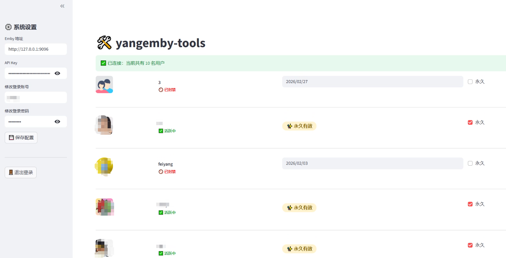
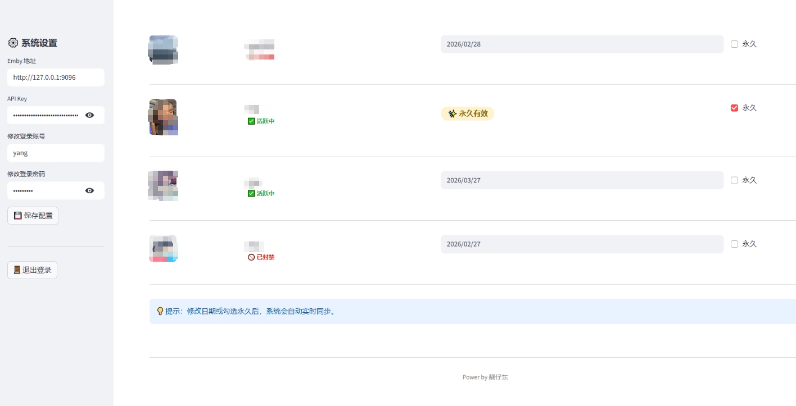
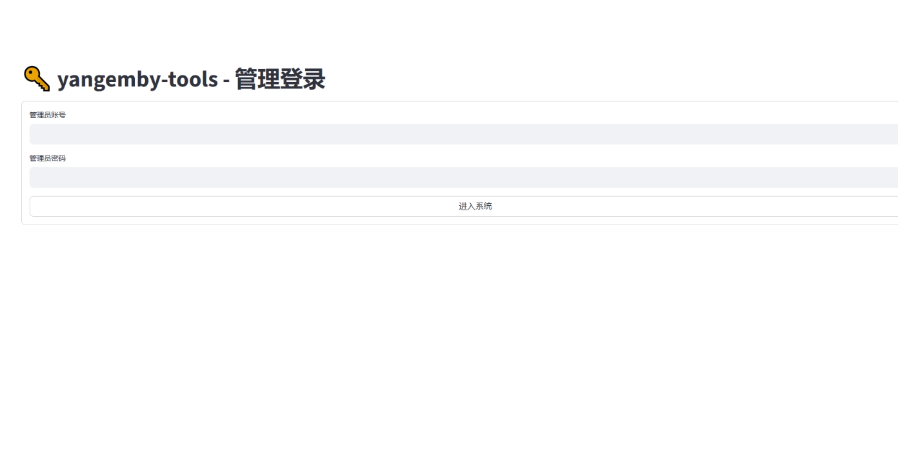

# 🛠️ yangemby-tools

这是一个专门为 Emby 管理员设计的用户有效期管理工具。

## 🚀 极简部署 (Docker Compose)

复制以下内容到你的 `docker-compose.yml`，修改变量后运行即可：

```yaml
version: '3.8'
services:
  emby-manager:
    image: liangzaidong/yangemby-tools:latest
    container_name: yangemby-tools
    restart: always
    network_mode: bridge
    ports:
      - "8055:8501" 
    volumes:
      - "/volume1/docker/yangemby/data:/app/data" # 这里改写为你存放数据的路径
    environment:
      - TZ=Asia/Shanghai
      - EMBY_URL=http://你的IP:8096        # 填入你的 Emby 地址
      - EMBY_API_KEY=你的API密钥           # 填入你的 API Key
      - ADMIN_USERNAME=admin              # 网页登录账号
      - ADMIN_PASSWORD=admin              # 网页登录密码
-----------------------------------------------------------------------------------------
👨‍💻 作者:靓仔东

🐳 Docker 镜像: liangzaidong/yangemby-tools:latest

💖 特别感谢: 安卓电视AppleTv群
------------------------------------------------------------------------------------------
## 🖼️ 部署效果截图
# yangemby-tools

## 使用截图






